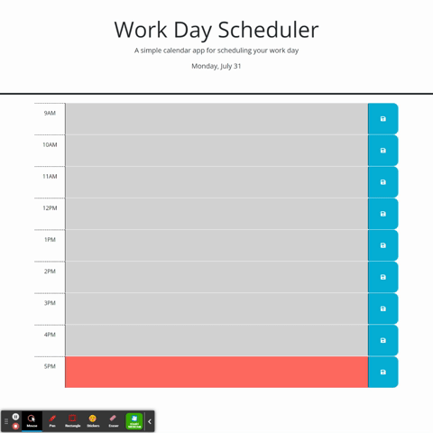

# Work-Day-Scheduler

## Table of Contents

- [Description](#description)
- [Deployed-URL](#deployed-url)
- [Credits](#credits)
- [License](#license)
- [Tests](#tests)
- [Questions](#questions)

## Description

```md
- Create a daily work scheduler
- Current date displays on the top of the calendar
- Display timeblocks from 9-5 color coded indicating whether it is the past, present, or future time
- Saves user input to local storage
- Retrieves local storage to apply value in according timeblock
- Input still appears after refreshing page
```

## Deployed URL

https://dmerk2.github.io/Work-Day-Scheduler/

## Usage



## Credits

```
Daniel Merkin contributed to this project
```

## License

```
MIT License
```

## Test

```
N/A
```

## Questions

GitHub: [dmerk2](https://github.com/dmerk2)<br>
Email: dan.merkin@gmail.com
